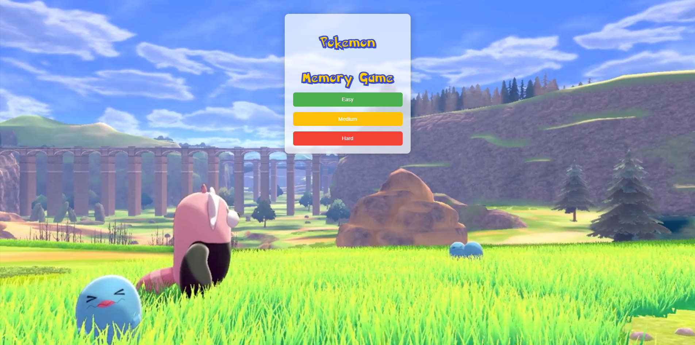

# Pokémon Memory Game

A web-based memory card game featuring Pokémon characters, built with React and the PokéAPI. Test your memory by matching Pokémon pairs across different difficulty levels.

## Features

- **Three Difficulty Levels:**
  - Easy (2x2 grid - 4 cards)
  - Medium (4x4 grid - 16 cards)
  - Hard (8x8 grid - 64 cards)

- **Pokémon Categories:**
  - Starter Pokémon (Bulbasaur, Charmander, Squirtle, etc.)
  - Legendary Pokémon (Articuno, Zapdos, Moltres, etc.)
  - Popular Pokémon (Charizard, Blastoise, Snorlax, etc.)

- **Interactive Elements:**
  - Card flip animations
  - Move counter
  - Victory celebration with confetti effect
  - Responsive design for different screen sizes

## Technologies Used

- React
- PokéAPI for Pokémon sprites
- Canvas Confetti for victory animations
- CSS for animations and styling
- Pokémon Font for authentic styling

## How to Play

1. Select a difficulty level (Easy, Medium, or Hard)
2. Click on cards to flip them
3. Find matching pairs of Pokémon
4. Complete the game with as few moves as possible
5. Enjoy the victory celebration when you win!

## Setup

1. Clone the repository
2. Open `index.html` in a modern web browser
3. No build tools or installation required!

## Credits

- Pokémon sprites from [PokéAPI](https://pokeapi.co/)
- Pokémon font from [Fonts CDNFONTS](https://fonts.cdnfonts.com/css/pokemon-solid)
- Background images from Official Pokémon Assets

## License

This project is created for educational purposes. All Pokémon images and names are property of The Pokémon Company and Nintendo.
